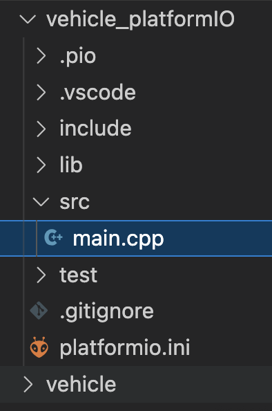

A simple setup just to make sure that everything works.

Note 1: It took me well over 2 hours, because I decided to use VS Code. This video helped me in the end to actually run everything: https://www.youtube.com/watch?v=ac7PJn8NH7o&ab_channel=ProgrammingElectronicsAcademy

Note 2: It stopped working in the morning so I had to switch to PlatformIO. That works fine. The only problem is that it only works in the special folder. The dummy solution is to coppy it. There folders are then just for storing the code. The actual code is in the PlatformIO folder. I will try to solve this later (e.g. linking to the real code??). I followed this tutorial: https://www.youtube.com/watch?v=dany7ae_0ks&t=84s&ab_channel=MakeUseOf

This is the place where the real code is stored: 

'C:\Users\username\Documents\PlatformIO\Projects\arduino_vehicle\src'
